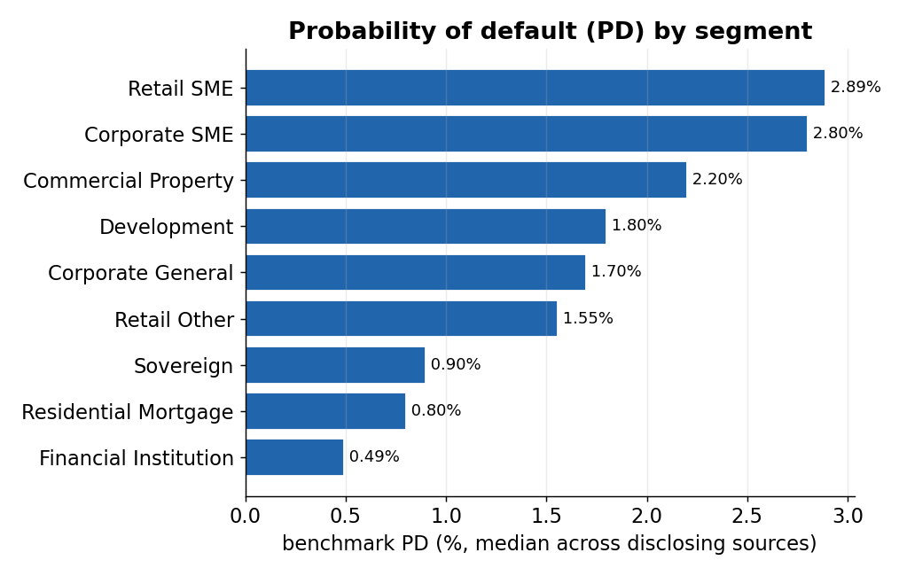
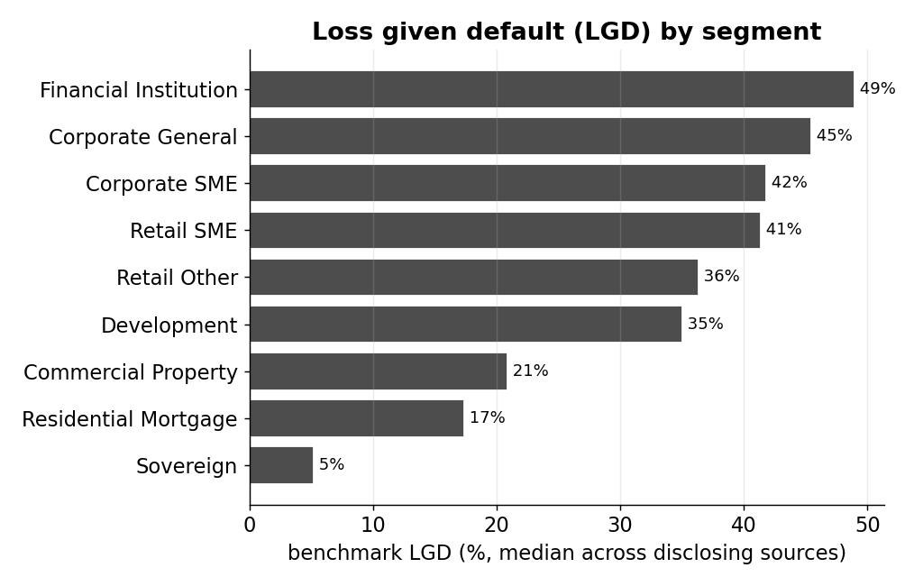
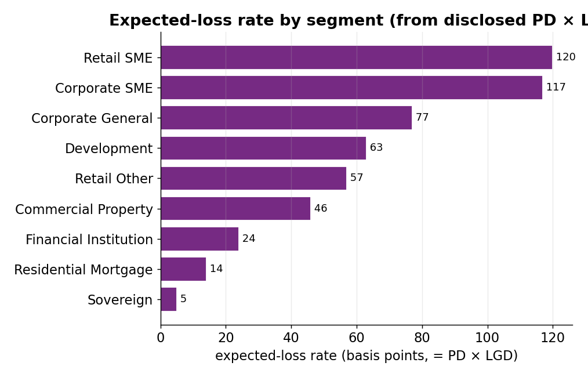
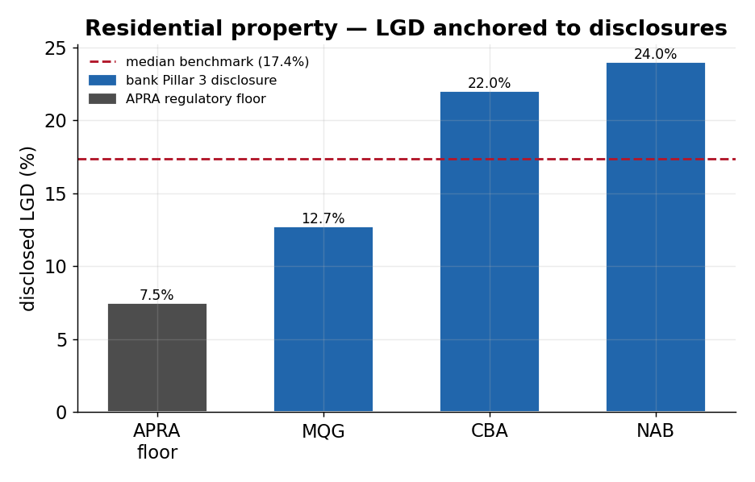
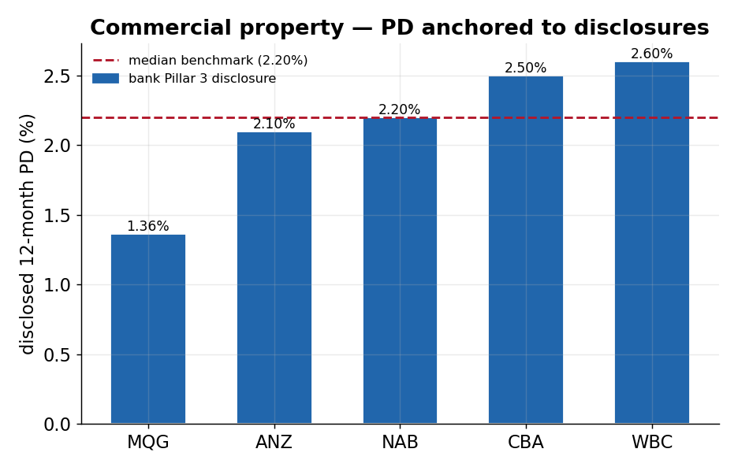
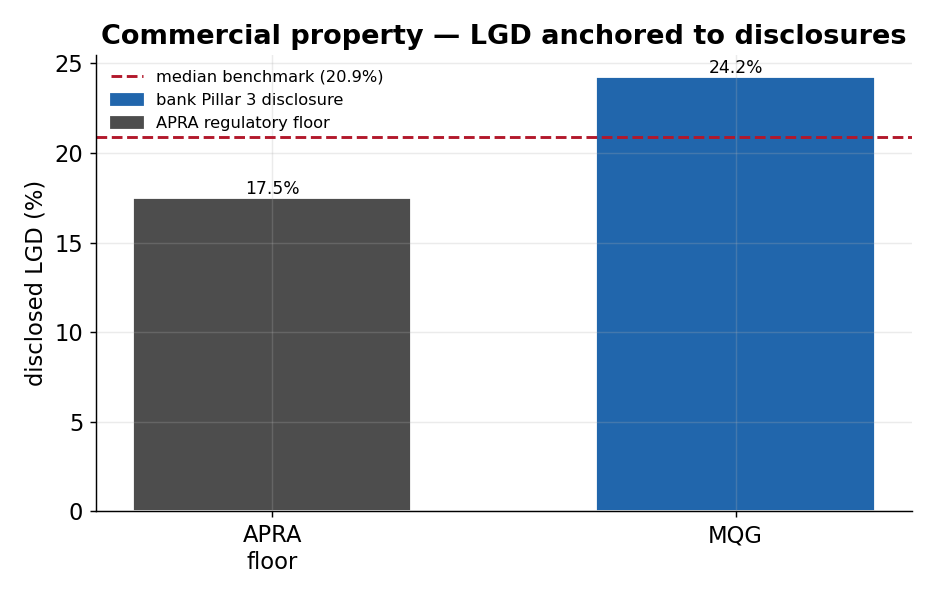

# External Benchmark Engine

**A reproducible Python pipeline that turns Australian bank and regulator
disclosures into credit-risk model inputs — PD, LGD, expected loss,
stress-test rates, and portfolio-monitoring metrics.**

Every quarter the Big 4 banks, Macquarie, APRA, the RBA, S&P, and a long list of
ASX-listed non-bank lenders publish credit-risk numbers — but in PDFs,
spreadsheets and HTML, each with its own definitions and reporting calendar. This
engine collects those numbers, aligns them to a common segment/definition scheme
aligned to **APRA APS 113 / Basel IRB**, and emits model-ready CSVs and a
committee-ready report. Every figure is a **source-published value — no
modelling overlay** — so each number traces to a named disclosure and date, and
the same inputs always produce byte-identical outputs.

## What it demonstrates

Built the way a credit-risk / model-risk analytics function would build it. What
the repo actually contains (every item below is backed by code and committed
outputs):

- **PD & LGD per segment** — sourced and standardised across 5+ banks plus regulators; **EL = PD × LGD** ([model_inputs.py](src/model_inputs.py)). EAD is left to the consuming deal model by design.
- **Stress testing** — mild (Basel CRE36.51) and severe (APS 220 para 72) PD/LGD/EAD multipliers with regulatory PD floors → base-vs-stressed EL per segment ([stress_scenarios.py](src/stress_scenarios.py)).
- **Portfolio monitoring** — per-bank, per-industry exposure, NPL, provisions and write-offs from Big 4 Pillar 3.
- **Validation & governance** — cross-source spread / outlier / vintage / peer-ratio checks ([validation.py](src/validation.py)) and read-only staleness / coverage / data-quality reports ([governance.py](src/governance.py)); both *flag* anomalies and never overwrite the underlying data.
- **Data engineering** — PDF/Excel/HTML ETL into a SQLite/SQLAlchemy registry with a full audit trail, a Click CLI, and a **595-test** pytest suite (all passing).

Written in **Python** (pandas, SQLAlchemy, pydantic, Click, pdfplumber,
python-docx). The skills transfer directly to SAS/SQL/R model-development and
validation work.

## Related projects

This repo is the **data & benchmark** layer of a three-stage credit-risk
capability — *data & benchmarks → model development → validation*:

- **Data & benchmarks** — this repo: traceable PD/LGD/ECL/stress model inputs from Australian regulatory disclosures.
- **Model development** — [`consumer-credit-pd-ead-scorecard`](https://github.com/Jane511/consumer-credit-pd-ead-scorecard): a PD scorecard build with validation. Mortgage PD/LGD/EAD models — *(link to be added once published)*.
- **Validation & monitoring** — the cross-source and governance checks built into this engine ([validation.py](src/validation.py), [governance.py](src/governance.py)).

---

## See it in 30 seconds

- 📄 **Sample report** — [`outputs/reports/Credit_Risk_Report_Q2_2026.md`](outputs/reports/Credit_Risk_Report_Q2_2026.md): executive summary, then PD, LGD, expected-loss, stress-test, portfolio-monitor and per-bank industry tables (also [`.docx`](outputs/reports/Credit_Risk_Report_Q2_2026.docx)).
- 📊 **Model-input data** — [`outputs/data/expected_loss_inputs.csv`](outputs/data/expected_loss_inputs.csv): median PD, median LGD and the expected-loss rate (bp) per segment.

> *From the report's executive summary:* "This report consolidates
> externally-disclosed credit-risk parameters for Australian bank and non-bank
> lenders into a single set of model-ready benchmarks… aligned to the APRA APS
> 113 / Basel IRB framework. Every figure is a source-published value — no
> adjustment, triangulation, or modelling overlay — so each number traces back
> to a named disclosure and reporting date."

---

## Key charts

*All charts are regenerated from the committed model-input CSVs in
[outputs/data/](outputs/data/) by [tools/make_figures.py](tools/make_figures.py)
— source-published benchmark values only.*

### 1. PD by segment



**What this shows:** the benchmark 12-month PD (median across disclosing sources) for each lending segment.
**Why it matters:** the first input every pricing, ECL or capital calculation needs — SME exposures default ~3–4× more often than residential mortgages.

### 2. LGD by segment



**What this shows:** the benchmark LGD (median across disclosing sources) for each segment — shown separately from PD so each parameter is read on its own.
**Why it matters:** LGD is the other half of expected loss and ranks segments very differently from PD — residential mortgages have low LGD (well-secured), unsecured/financial exposures the highest.

### 3. Expected-loss rate by segment



**What this shows:** the benchmark expected-loss rate (PD × LGD, in basis points) per segment.
**Why it matters:** the one-glance risk ranking — residential mortgages cost ~14bp of expected loss a year, unsecured SME lending an order of magnitude more.

### 4. The numbers are anchored to real disclosures

Each benchmark is the **median of what multiple named sources actually
disclosed** — not an invented or single-source number. Anchor charts are shown
for the two segments the Australian disclosures publish across several sources;
the grey bar is the APRA regulatory floor, the dashed line the median the engine
uses.

#### Residential property — PD and LGD




#### Commercial property — PD and LGD




> **Why only these two segments?** An anchor chart is only meaningful where
> *several* sources disclose the parameter. Australian Pillar 3 / APRA
> disclosures publish PD and LGD by **Basel asset class**, not by *working-capital*
> or *trade-finance* product. Across the loaded sources, only residential and
> commercial property carry a multi-bank PD spread. **SME / corporate working
> capital** and **SME / corporate trade finance** are not separately disclosed
> with PD across banks — they appear only as single APRA LGD floors (unsecured
> working capital, invoice finance) with no multi-source PD — so they cannot be
> honestly anchored here and are left to the consuming model. (Corporate SME
> *does* have a 5-bank PD spread but single-source LGD; available on request.)

---

## Stress testing

Each segment's PD and LGD are stressed under two regulator-aligned scenarios —
a **mild** recession (Basel CRE36.51 minimum: PD ×1.5, LGD ×1.2) and a
**severe**, GFC-like downturn (APS 220 para 72: PD ×2.5, LGD ×1.4) — with
regulatory PD upper-band floors applied where they bind. Expected loss
(PD × LGD) escalates accordingly ([stress_testing_inputs.csv](outputs/data/stress_testing_inputs.csv)):

| Segment | Base EL (bp) | Mild EL (bp) | Severe EL (bp) | Severe ÷ base |
|---|---:|---:|---:|---:|
| Retail SME | 120 | 215 | 419 | 3.5× |
| Corporate SME | 117 | 301 | 410 | 3.5× |
| Corporate General | 77 | 139 | 270 | 3.5× |
| Development | 63 | 210 | 245 | **3.9×** |
| Retail Other | 57 | 102 | 198 | 3.5× |
| Commercial Property | 46 | 125 | 161 | 3.5× |
| Financial Institution | 24 | 43 | 85 | 3.5× |
| Residential Mortgage | 14 | 25 | 49 | 3.5× |
| Sovereign | 5 | 8 | 16 | 3.5× |

Severe stress lifts expected loss ~**3.5×** across the board (the combined
2.5 × 1.4 multiplier); **Development** rises further (3.9×) because its
regulatory PD floor binds even in the mild scenario. The full per-scenario PD,
LGD, EAD multipliers and macro narratives are in the CSV and report.

---

## What it produces

Each cycle the engine emits two things.

**Five model-input CSVs** in `outputs/data/` — the stable contract for any
downstream PD/LGD/ECL model:

| File | Contents |
| --- | --- |
| `pd_inputs.csv` | Latest PD observation per source and segment |
| `lgd_inputs.csv` | Latest LGD observation per source and segment |
| `expected_loss_inputs.csv` | Segment-level median PD, median LGD, and EL rate |
| `stress_testing_inputs.csv` | Base and stressed PD / LGD / EL rates |
| `portfolio_monitor_inputs.csv` | Arrears, NPL, impaired, and loss-rate metrics |

**A credit-risk report** in [`outputs/reports/`](outputs/reports/) —
`Credit_Risk_Report_<period>.md` / `.html` / `.docx`. It opens with a
plain-English executive summary, then the PD, LGD, expected-loss,
stress-testing, portfolio-monitor, and per-bank industry tables. A sample is
checked in: [`outputs/reports/Credit_Risk_Report_Q2_2026.md`](outputs/reports/Credit_Risk_Report_Q2_2026.md).

A slice of the expected-loss table gives the flavour:

| Segment | PD | LGD | EL rate | PD sources | LGD sources |
| --- | --- | --- | --- | --- | --- |
| Residential Mortgage | 0.01 | 0.17 | 0.00 | 5 | 4 |
| Corporate SME | 0.03 | 0.42 | 0.01 | 5 | 1 |
| Commercial Property | 0.02 | 0.21 | 0.00 | 5 | 2 |
| Development | 0.02 | 0.35 | 0.01 | 4 | 4 |

---

## How it works

```text
   Published disclosures              This engine                 Outputs
 ┌────────────────────────┐    ┌──────────────────────────┐   ┌──────────────┐
 │ Pillar 3 PDFs (Big 4,  │    │ adapters/  parse PDF/XLSX │   │ 5 CSV model  │
 │   Macquarie)           │──▶ │            /HTML per src  │──▶│ input tables │
 │ APRA QPEX + ADI stats  │    │ registry/  SQLite store + │   │              │
 │ RBA FSR, S&P RMBS      │    │            audit trail    │   │ md/html/docx │
 │ Non-bank lender IR     │    │ model_inputs/ derive PD,  │   │ report       │
 │   disclosures          │    │            LGD, EL, stress│   │              │
 └────────────────────────┘    └──────────────────────────┘   └──────────────┘
```

Two ideas hold the design together:

- **Every observation is labelled, never silently merged.** A
  `data_definition_class` records exactly what each source measured — a Basel
  12-month PD is not a 90-day arrears rate or an impaired-loan ratio — and a
  `cohort` records who published it (Big 4, other major bank, non-bank,
  regulator, rating agency, regulatory floor). Aligning those definitions is the
  consuming model's decision, made explicit rather than hidden.
- **The same inputs always produce the same outputs.** No randomness, no hidden
  state; rerunning the pipeline on the same database yields byte-identical CSVs,
  which is what makes the outputs auditable.

---

## Running it

From a fresh clone:

```bash
# 1. Install
python -m venv .venv
.venv\Scripts\activate                 # Windows; macOS/Linux: source .venv/bin/activate
pip install -e ".[ingestion,download,reports]"

# 2. Build the database from the bundled Australian seed data
python cli.py --db benchmarks.db seed
python src/migrate_to_raw_observations.py --db benchmarks.db

# 3. Produce the CSV bundle
python cli.py --db benchmarks.db export-csvs

# 4. Produce the report (markdown / html / docx)
python cli.py --db benchmarks.db report benchmark --format docx --period-label "Q1 2026"
```

The `seed` command bootstraps a working database with canonical Australian data,
so you can generate a full report without downloading anything. To refresh from
live disclosures each quarter, see the [operations guide](docs/operations.md).

---

## Data sources

| Source | Cadence | What it provides |
| --- | --- | --- |
| CBA / NAB / WBC / ANZ Pillar 3 | Half-yearly + quarterly | Basel PDs, LGDs, per-industry exposures |
| Macquarie Pillar 3 | Half-yearly | Basel PDs / LGDs (classified separately from Big 4) |
| APRA Quarterly ADI Performance + Property Exposures (QPEX) | Quarterly | NPL ratios, arrears, impaired-loan ratios |
| RBA Financial Stability Review / SMP / Chart Pack | Semi-annual–quarterly | Sector arrears and stress context |
| S&P SPIN | Monthly | Australian RMBS arrears |
| APS 113 slotting + floors | — | Regulatory PD/LGD grades and minimum floors |
| ASX-listed non-bank lenders (MoneyMe, Plenti, Pepper, La Trobe, Liberty, Resimac, Latitude, humm, Zip, Judo, Qualitas, Metrics) | Half-yearly–annual | Arrears, impaired and loss rates, commentary |

Full download cadence and manual-fetch instructions are in the
[operations guide](docs/operations.md).

---

## Repository layout

```text
external_benchmark_engine/
├── cli.py                      # Click CLI — start here
├── config/                     # Reality-check bands + refresh schedules (YAML)
├── ingestion/
│   ├── adapters/               # One PDF/XLSX/HTML adapter per publisher
│   ├── aggregation/            # Big 4 per-industry exposure aggregation
│   ├── pillar3/                # Per-bank Pillar 3 entry points
│   └── source_registry.py      # Catalogue of every source URL + cache layout
├── src/
│   ├── models.py               # RawObservation, Cohort, DataDefinitionClass
│   ├── registry.py             # add / supersede / query, with audit trail
│   ├── model_inputs.py         # Derive PD, LGD, EL, stress, monitor tables
│   ├── stress_scenarios.py     # Mild / severe PD-LGD-EAD stress + floors
│   ├── validation.py           # Spread / outlier / vintage / peer-ratio checks
│   ├── governance.py           # Staleness / quality / coverage reports
│   ├── benchmark_report.py     # Markdown + HTML + DOCX renderer
│   ├── csv_exporter.py         # The five model-input CSVs
│   ├── download_sources/       # Source downloaders (APRA, RBA, Pillar 3, non-bank)
│   └── migrate_to_raw_observations.py  # Loader into the raw-observation store
├── outputs/                    # reports/ (md/html/docx) + data/ CSVs + charts/
├── tools/make_figures.py       # regenerate charts into outputs/charts/
├── tests/                      # 595 tests (unit + integration), all passing
└── docs/                       # Operations guide
```

---

## Scope — the one question it answers

The engine answers exactly one question:

> *What did each external source publish for this segment, in this period, under
> what definition?*

It deliberately does **not** decide what the consensus benchmark is, how to align
definitions to a single Basel view, or where a loss-rate assumption should be
capped. Those are calibration decisions that belong to the PD, LGD, or ECL model
that consumes these inputs. Keeping that boundary sharp — data assembly here,
modelling judgement there — is what makes the outputs trustworthy as a benchmark.

---

*Built by Jane Wu. Licensed MIT. For operational detail (downloaders,
migrations, troubleshooting) see [`docs/operations.md`](docs/operations.md).*

## License

Released under the MIT License — free to read, run, and reuse with attribution.
