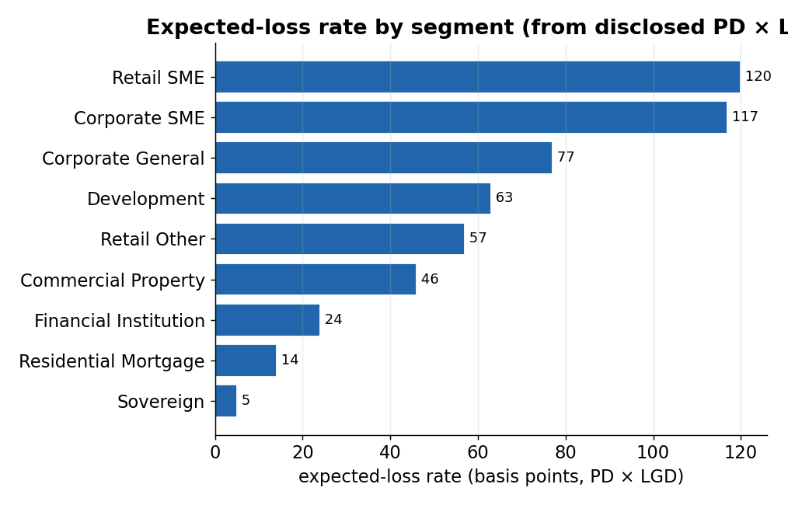
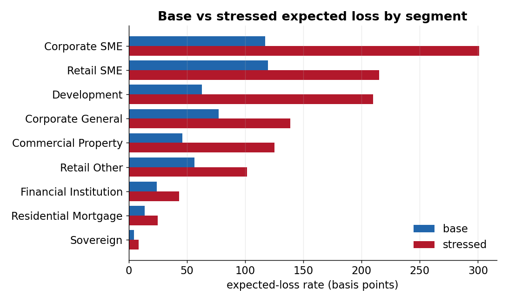
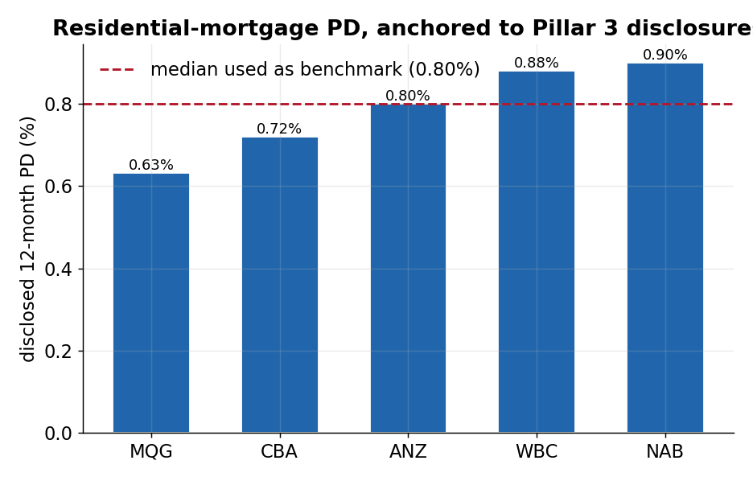

# External Benchmark Engine

**A reproducible Python pipeline that turns Australian bank and regulator
disclosures into credit-risk model inputs — PD, LGD, expected loss,
stress-test rates, and portfolio-monitoring metrics.**

## See it in 30 seconds

- 📄 **Sample report** — [`output/Credit_Risk_Report_Q2_2026.md`](output/Credit_Risk_Report_Q2_2026.md): executive summary followed by PD, LGD, expected-loss, stress-test, portfolio-monitor and per-bank industry tables (also available as [`.docx`](output/Credit_Risk_Report_Q2_2026.docx)).
- 📊 **Model-input data** — [`output/data/expected_loss_inputs.csv`](output/data/expected_loss_inputs.csv): median PD, median LGD and the expected-loss rate (in basis points) per segment.

> *From the report's executive summary:* "This report consolidates
> externally-disclosed credit-risk parameters for Australian bank and
> non-bank lenders into a single set of model-ready benchmarks… aligned to
> the APRA APS 113 / Basel IRB framework. Every figure is a source-published
> value — no adjustment, triangulation, or modelling overlay — so each
> number traces back to a named disclosure and reporting date."

---

## Key charts

*All charts are regenerated from the committed model-input CSVs in [output/data/](output/data/)
by [reports/make_figures.py](reports/make_figures.py) — source-published benchmark values only.*

### 1. Expected-loss rate by segment


**What this shows:** the benchmark expected-loss rate (PD × LGD, in basis points) for each lending segment, built from disclosed bank and regulator figures.
**Why it matters:** it is the one-glance risk ranking of segments — residential mortgages cost ~14bp of expected loss a year, unsecured SME lending an order of magnitude more.

### 2. Base vs stressed expected loss


**What this shows:** each segment's expected-loss rate today versus after the PD/LGD stress multipliers are applied.
**Why it matters:** it sizes how much more capital each segment consumes in a downturn — the core output a stress-testing or ICAAP process needs.

### 3. The numbers are anchored to real disclosures


**What this shows:** the residential-mortgage PD each major bank actually disclosed in its Pillar 3 report, with the median the engine uses as the benchmark.
**Why it matters:** every benchmark traces back to named, dated, source-published values across five banks — not an invented or single-source number.

---

Every quarter, the Big 4 banks, Macquarie, APRA, the RBA, S&P, and a long
list of ASX-listed non-bank lenders publish credit-risk numbers — but they
publish them in PDFs, spreadsheets, and HTML pages, each using its own
definitions and reporting calendar. This project collects those numbers,
aligns them to a common segment and definition scheme, and produces a clean
set of model-input tables and a committee-ready report.

It is built the way a model-risk or credit-risk analytics function would
want it built: every number is traced back to the source disclosure it came
from, definitions are labelled explicitly rather than silently merged, and
the same inputs always produce byte-identical outputs.

---

## What this project demonstrates

This is a portfolio project. If you are evaluating it for a credit-risk or
quantitative-modelling role, here is what it shows:

| Area | In this project |
| --- | --- |
| **PD / LGD / EAD parameters** | Sources and standardises probability-of-default and loss-given-default observations per segment, and derives expected-loss rates (`EL = PD × LGD`). EAD is left to the consuming deal model by design — a deliberate, defensible scoping choice. |
| **IFRS 9 / ECL** | Expected loss is published as a rate built from PD × LGD, the core of an IFRS 9 expected-credit-loss calculation. |
| **Regulatory capital (Basel III / APRA APS 113)** | Ingests Basel-aligned 12-month PDs from Pillar 3 disclosures and APS 113 slotting grades and regulatory PD/LGD floors. |
| **Stress testing** | Applies PD/LGD stress multipliers and regulatory upper-band floors to produce base-vs-stressed expected-loss rates per segment. |
| **Concentration & portfolio risk** | Builds a per-bank, per-industry view of exposure, non-performing exposure, provisions, and write-offs from Big 4 Pillar 3 disclosures — the basis for industry-concentration monitoring. |
| **Australian regulatory landscape** | Works directly with Pillar 3, APRA Quarterly ADI Performance and Property Exposures (QPEX), the RBA Financial Stability Review, and S&P RMBS arrears. |
| **Data engineering** | ETL from PDF, Excel, and HTML into a SQLite/SQLAlchemy registry with a full audit trail; a Click CLI; reproducible CSV and report outputs; and a pytest suite of 595 tests (all passing). |
| **Model validation** | [`src/validation.py`](src/validation.py) runs cross-source checks per segment — spread (max−min across peers), outlier detection (a peer source vs the peer median), vintage staleness, and a Big-4-vs-non-bank peer ratio. It *flags* anomalies and surfaces regulator/floor anchors separately; it never overwrites or filters the underlying data. |
| **Monitoring & governance** | [`src/governance.py`](src/governance.py) is a read-only observer that produces staleness, a 5-dimension data-quality matrix, coverage (segments with < 2 independent sources), and peer-divergence (> 30% vs peer median) reports — the recurring checks a model-monitoring function runs each cycle, with the audit trail preserved. |

These two map directly to a **model validation & monitoring** role: the
engine already implements the anomaly, coverage, vintage and peer-divergence
checks such a function performs, and stops short of the calibration
judgement that belongs to the model owner.

Written in **Python** (pandas, SQLAlchemy, pydantic, Click, pdfplumber,
python-docx). The skills transfer directly to SAS/SQL/R model-development
and validation work.

---

## Related projects

This repo is the **data & benchmark** layer of a three-stage credit-risk
capability — *data & benchmarks → model development → validation*:

- **Data & benchmarks** — this repo: traceable PD/LGD/ECL/stress model
  inputs assembled from Australian regulatory disclosures.
- **Model development** —
  [`consumer-credit-pd-ead-scorecard`](https://github.com/Jane511/consumer-credit-pd-ead-scorecard):
  a PD scorecard build with validation. Mortgage PD/LGD/EAD models —
  *(link to be added once published)*.
- **Validation & monitoring** — the cross-source and governance checks built
  into this engine ([`validation.py`](src/validation.py),
  [`governance.py`](src/governance.py)).

---

## What it produces

Each cycle the engine emits two things.

**Five model-input CSVs** in `output/data/` — the stable contract for any
downstream PD/LGD/ECL model:

| File | Contents |
| --- | --- |
| `pd_inputs.csv` | Latest PD observation per source and segment |
| `lgd_inputs.csv` | Latest LGD observation per source and segment |
| `expected_loss_inputs.csv` | Segment-level median PD, median LGD, and EL rate |
| `stress_testing_inputs.csv` | Base and stressed PD / LGD / EL rates |
| `portfolio_monitor_inputs.csv` | Arrears, NPL, impaired, and loss-rate metrics |

**A credit-risk report** at the top of [`output/`](output/) —
`Credit_Risk_Report_<period>.md` / `.html` / `.docx`. It opens with a
plain-English executive summary, then the PD, LGD, expected-loss,
stress-testing, portfolio-monitor, and per-bank industry tables. A sample
is checked in: [`output/Credit_Risk_Report_Q2_2026.md`](output/Credit_Risk_Report_Q2_2026.md).

A slice of the expected-loss table gives the flavour:

| Segment | PD | LGD | EL rate | PD sources | LGD sources |
| --- | --- | --- | --- | --- | --- |
| Residential Mortgage | 0.01 | 0.17 | 0.00 | 5 | 4 |
| Corporate SME | 0.03 | 0.42 | 0.01 | 5 | 1 |
| Commercial Property | 0.02 | 0.21 | 0.00 | 5 | 2 |
| Development | 0.02 | 0.35 | 0.01 | 4 | 4 |

The report also includes a per-bank, per-industry exposure and
non-performing-exposure monitor built from Big 4 Pillar 3 disclosures.

---

## How it works

```text
   Published disclosures              This engine                 Outputs
 ┌────────────────────────┐    ┌──────────────────────────┐   ┌──────────────┐
 │ Pillar 3 PDFs (Big 4,  │    │ adapters/  parse PDF/XLSX │   │ 5 CSV model  │
 │   Macquarie)           │──▶ │            /HTML per src  │──▶│ input tables │
 │ APRA QPEX + ADI stats  │    │ registry/  SQLite store + │   │              │
 │ RBA FSR, S&P RMBS      │    │            audit trail    │   │ md/html/docx │
 │ Non-bank lender IR     │    │ model_inputs/ derive PD,  │   │ report       │
 │   disclosures          │    │            LGD, EL, stress│   │              │
 └────────────────────────┘    └──────────────────────────┘   └──────────────┘
```

Two ideas hold the design together:

- **Every observation is labelled, never silently merged.** A
  `data_definition_class` records exactly what each source measured — a
  Basel 12-month PD is not the same thing as a 90-day arrears rate or an
  impaired-loan ratio — and a `cohort` records who published it (Big 4,
  other major bank, non-bank, regulator, rating agency, regulatory floor).
  Aligning those definitions is the consuming model's decision, made
  explicit rather than hidden.

- **The same inputs always produce the same outputs.** No randomness, no
  hidden state; rerunning the pipeline on the same database yields
  byte-identical CSVs, which is what makes the outputs auditable.

---

## Running it

From a fresh clone:

```bash
# 1. Install
python -m venv .venv
.venv\Scripts\activate                 # Windows; macOS/Linux: source .venv/bin/activate
pip install -e ".[ingestion,download,reports]"

# 2. Build the database from the bundled Australian seed data
python cli.py --db benchmarks.db seed
python src/migrate_to_raw_observations.py --db benchmarks.db

# 3. Produce the CSV bundle
python cli.py --db benchmarks.db export-csvs

# 4. Produce the report (markdown / html / docx)
python cli.py --db benchmarks.db report benchmark --format docx --period-label "Q1 2026"
```

The `seed` command bootstraps a working database with canonical Australian
data, so you can generate a full report without downloading anything. To
refresh from live disclosures each quarter, see the
[operations guide](docs/operations.md).

---

## Data sources

| Source | Cadence | What it provides |
| --- | --- | --- |
| CBA / NAB / WBC / ANZ Pillar 3 | Half-yearly + quarterly | Basel PDs, LGDs, per-industry exposures |
| Macquarie Pillar 3 | Half-yearly | Basel PDs / LGDs (classified separately from Big 4) |
| APRA Quarterly ADI Performance + Property Exposures (QPEX) | Quarterly | NPL ratios, arrears, impaired-loan ratios |
| RBA Financial Stability Review / SMP / Chart Pack | Semi-annual–quarterly | Sector arrears and stress context |
| S&P SPIN | Monthly | Australian RMBS arrears |
| APS 113 slotting + floors | — | Regulatory PD/LGD grades and minimum floors |
| ASX-listed non-bank lenders (MoneyMe, Plenti, Pepper, La Trobe, Liberty, Resimac, Latitude, humm, Zip, Judo, Qualitas, Metrics) | Half-yearly–annual | Arrears, impaired and loss rates, commentary |

Full download cadence and manual-fetch instructions are in the
[operations guide](docs/operations.md).

---

## Repository layout

```text
external_benchmark_engine/
├── cli.py                      # Click CLI — start here
├── config/                     # Reality-check bands + refresh schedules (YAML)
├── ingestion/
│   ├── adapters/               # One PDF/XLSX/HTML adapter per publisher
│   ├── aggregation/            # Big 4 per-industry exposure aggregation
│   ├── pillar3/                # Per-bank Pillar 3 entry points
│   └── source_registry.py      # Catalogue of every source URL + cache layout
├── src/
│   ├── models.py               # RawObservation, Cohort, DataDefinitionClass
│   ├── registry.py             # add / supersede / query, with audit trail
│   ├── model_inputs.py         # Derive PD, LGD, EL, stress, monitor tables
│   ├── validation.py           # Spread / outlier / vintage / peer-ratio checks
│   ├── governance.py           # Staleness / quality / coverage reports
│   ├── benchmark_report.py     # Markdown + HTML + DOCX renderer
│   ├── csv_exporter.py         # The five model-input CSVs
│   ├── download_sources/       # Source downloaders (APRA, RBA, Pillar 3, non-bank)
│   └── migrate_to_raw_observations.py  # Loader into the raw-observation store
├── output/                     # Credit-risk report (md/html/docx) + data/ CSVs
├── tests/                      # 595 tests (unit + integration), all passing
└── docs/                       # Operations guide
```

---

## Scope — the one question it answers

The engine answers exactly one question:

> *What did each external source publish for this segment, in this period,
> under what definition?*

It deliberately does **not** decide what the consensus benchmark is, how to
align definitions to a single Basel view, or where a loss-rate assumption
should be capped. Those are calibration decisions that belong to the PD,
LGD, or ECL model that consumes these inputs. Keeping that boundary sharp —
data assembly here, modelling judgement there — is what makes the outputs
trustworthy as a benchmark.

---

*Built by Jane Wu. Licensed MIT. For operational detail (downloaders,
migrations, troubleshooting) see [`docs/operations.md`](docs/operations.md).*
</content>
